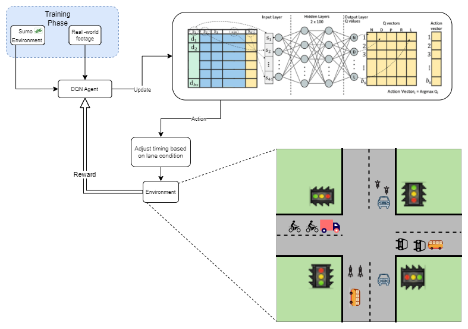
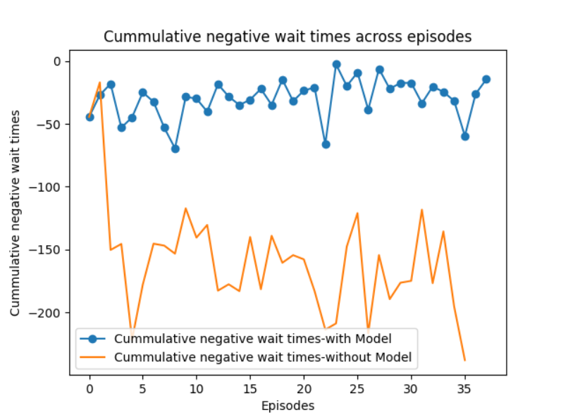
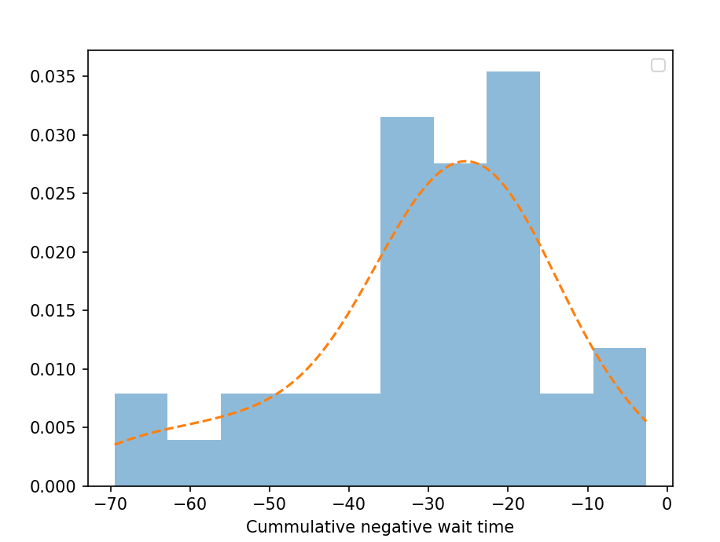
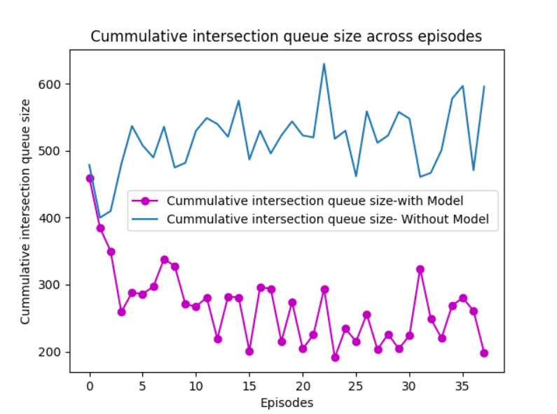
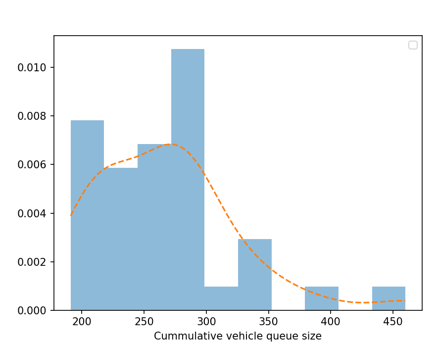

## 1. Adaptive Traffic Signal Control
The advancement of Deep Q-learning has revolutionized traffic management strategies, offering a promising solution to alleviate congestion and optimize urban mobility. Deep Q-learning, an integration of reinforcement learning principles with Deep Neural Networks (DNNs), empowers agent to learn optimal policies for traffic control by interacting with dynamic environments. This section provides a comprehensive overview of reinforcement learning, Q-learning, and Deep Q-learning algorithms. Reinforcement learning algorithms enable agents to navigate environments by taking actions and receiving corresponding rewards, aiming to maximize expected future rewards. Key concepts such as state-space, action-space, and Q-values are fundamental to understanding the functionality of Q-learning algorithms. Additionally, we delve into the implementation details of Deep Q-learning in traffic management scenarios, emphasizing the utilization of DNNs to approximate Q-value functions and optimize traffic control strategies. The subsequent sections explore experiment settings, including traffic intersection properties, DNN architectures, reward functions, and simulation environments, culminating in an analysis of results and a conclusive summary of the study's findings.

The integration of SUMO, a high-fidelity traffic simulation platform, with OpenCV utilizing YOLO v8 for object detection and video processing brings forth a robust system capable of perceiving and responding to dynamic traffic changes in real-time. SUMO provides a comprehensive environment for simulating intricate traffic scenarios, enabling detailed analysis and informed decision-making. On the other hand, OpenCV with YOLO v8 offers efficient object detection and video processing capabilities,
, allowing the system to swiftly recognize and track various objects within the simulated traffic environment. By seamlessly integrating these technologies, the system gains the ability to interpret real-world traffic dynamics, detect critical events, and respond promptly with appropriate actions.

Through this exploration, we aim to underscore the potential of Deep Q-learning as a transformative tool in enhancing urban transportation systems and addressing contemporary challenges in traffic management.
## 1.1 Architecture Diagram

  
 

## 2. Deep Q-learning  
Deep Q-Learning (DQN) is a powerful reinforcement learning algorithm that combines deep neural networks with Q-learning to enable agents to learn optimal strategies in complex environments. At its core, DQN learns to approximate the Q-function, which represents the expected future rewards of taking a particular action in a given state. The Q-function is updated iteratively using the Bellman equation, which expresses the relationship between the Q-values of successive states.
n-DQN, a deep neural network serves as the function approximator, with the input being the state representation and the output being the Q-values for each possible action. The loss function used in DQN is typically the mean squared error (MSE), which quantifies the discrepancy between the predicted Q-values and the target Q-values. The training process involves iteratively sampling experiences from the agent's interaction with the environment, known as experience replay, and updating the network
parameters to minimize the loss. Additionally, DQN employs a separate target network to stabilize training by decoupling the target Q-value estimation from the Q-value updates. Through this iterative learning process, DQN enables agents to effectively navigate complex environments and learn optimal policies for maximizing cumulative rewards.
 

## 3. Experiment Setting
The experiment is set for traffic intersections supporting right-side lane driving.This section provides the details of the traffic intersection properties, state-space, action-space, DNN properties, reward function and traffic simulation used for training an Adaptive TLCS agent in this paper.   
### 3.1 Traffic light and Intersection
- The study examines a typical 4-way intersection prevalent on Indian roads, featuring arms extending in the North, South, East, and West directions. 
- Each arm of the intersection consists of four lanes, with an additional four lanes departing from the intersection. 
- Standardizing the layout, each arm spans a length of 110 meters.
- Lane functionalities are organized such that the rightmost lane allows vehicles to turn right or proceed straight, while the central lanes are designated for straight driving. 
- Left turns are restricted to the leftmost lane exclusively on each arm. 
- Traffic lights are installed at the leftmost lane of every arm, with the remaining three lanes sharing a common signal. 
- Transitions between 'Red' and 'Green' phases include a mandatory intermediate 'Yellow' phase to ensure safe traffic movement and adherence to signals.

<a/>  
  
### 3.2 State-Space
The state-space configuration involved categorizing incoming lanes, each controlled by a dedicated traffic light, into lane-groups. These lane-groups were further divided into 10 lane-cells, with shorter lane-cells near the intersection compared to those farther away, reflecting the varying traffic speeds and densities. Each traffic intersection arm, consisting of four lanes, was subdivided into two lane-groups with 10 lane-cells each, resulting in 20 lane-cells per arm and a total of 80 lane-cells for the entire intersection. If the distance is between 10 and 20 meters, the agent is in lane cell 1.
Similarly, if the distance falls within the ranges of 20 to 30, 30 to 40, and so on up to 90 to 100 meters, the agent is assigned
to lane cells 2 to 9, respectively. This state space was represented as a vector of 80 integers, where each element indicated the presence (1) or absence (0) of vehicles in a lane-cell.
**S** =[ e0, e1, e2 … e78, e79 ] where e є {0,1 }  

 
### 3.3 Action space
The action space encompasses all feasible actions that an agent can execute. In this context, each action correlates with a specific traffic light configuration, representing a potential state of the traffic signals managing the intersection. The permissible traffic light phases, constituting the action space, were delineated as follows:  
A = {NSA, NSWRA, EWA, EWRA}  							
- NSA: North South Advance corresponds to a traffic-signal state allowing traffic to go from North direction to South and from South to North. 
- NSWRA: North South West Right Advance corresponds to a traffic-signal state allowing traffic to go from North towards the West and from South towards the East. Right turns are permitted in these directions, while traffic in all other directions is stopped. 
- EWA: East West Advance corresponds to a traffic-signal state allowing traffic to go from East direct
direction to West and from West to East. 
- EWRA: East West Right Advance corresponds to a traffic-signal state allowing traffic to go from East towards the South and from West towards the North. Right turns are permitted in these directions, while traffic in all other directions is stopped.
<a/>  
  
Enabling traffic flow in a particular direction necessitates setting the corresponding traffic phase to green, with each phase lasting for a duration.  Notably, the adjustment of traffic phases is governed by dynamic **delta values derived from model** inferences rather than fixed durations.  

### 3.4 Deep Neural Network:
Our DNN model, implemented in the DQN algorithm, consists of the following components:

**Input Layer:** The input layer takes a binary vector of size 1 x 80, representing the state space of the environment.

**Hidden Layers:** The model comprises two hidden layers, each containing 400 units. Rectified Linear Unit (RELU) activation functions are applied to these hidden layers to introduce non-linearity into the network.

**Output Layer:** The output layer consists of 9 units, representing the action space of the environment. Each unit corresponds to a traffic light phase. The activation function used in the output layer is linear.

The DNN model is trained using the Mean Squared Error (MSE) loss function and optimized using the Adam optimizer.

### 3.5 Reward function:
_A new reward calculation method is proposed:_

##### Data Considered:
Queue lengths (number of waiting vehicles) in each direction (North, South, East, West) - denoted by _new_q_N, new_q_S, new_q_E, new_q_W_

Average waiting time per vehicle in each direction - denoted by _wait_time_N, wait_time_S, wait_time_E, wait_time_W_

##### Reward Calculation:

Cumulative Weighted Queue (WQ): Traffic congestion is quantified by taking cummulative sum of the product of queue lengths and waiting times for each direction.

_new_WQ = new_q_N * wait_time_N + new_q_S * wait_time_S + new_q_W * wait_time_W + new_q_E * wait_time_E_

##### Reward Generation:

The reward promotes congestion reduction.
Traditional ITLC (Intersection Traffic Light Control) algorithms typically focus on either queue lengths or average waiting times.

  
## 5. Implementation Details
The implementation for training an Adaptive TLCS for this paper includes three classes:  

**DeepQNetworkModel:** The purpose of the _'DeepQNetworkModel'_ class is to provide a deep Q-network model tailored for traffic management scenarios. Given the current state space representing the traffic situation, it generates optimal actions to optimize traffic flow and minimize congestion. This class encapsulates the functionality to predict suitable actions based on input states, facilitating real-time decision-making for efficient traffic management and time optimization.  

**SumoSimulationManager:** The _'SumoSimulationManager'_ class manages the simulation environment for traffic scenarios using SUMO (Simulation of Urban MObility). It initializes the simulation settings, controls the simulation steps, calculates rewards based on traffic conditions, and provides methods to interact with the simulation:
- Initializes simulation settings and controls simulation steps. 
- Calculates rewards based on traffic conditions for reinforcement learning. 
- Provides methods for simulation interaction like starting and resetting.
- Encodes the environment state based on vehicle positions. 
- Dynamically adds vehicles in real-time during the simulation, including from a real-time camera feed.

**TrafficLightControlAgent :** The purpose of the _'TrafficLightControlAgent'_ class is to manage the intelligent control of traffic lights within a simulation environment. It orchestrates the decision-making process for adjusting traffic light phases based on current traffic conditions, facilitates reinforcement learning for traffic light optimization, and evaluates traffic control strategies. Additionally, it tracks and records key performance metrics such as rewards and intersection queue lengths to assess the effectiveness of different control strategies.

**TrafficCameraProcessor** : The _'TrafficCameraProcessor'_ class processes live CCTV footage of traffic, detecting vehicles and dynamically adding them to a simulation environment. It utilizes the YOLOv5 model for vehicle detection and a tracking algorithm for object tracking. By analyzing vehicle positions relative to predefined lines representing traffic signal boundaries, it manages vehicle entry and exit in the simulation. The class integrates with a SUMO simulation environment to add or remove vehicles accordingly. Visual feedback, including annotated frames displaying incoming vehicle counts, is provided throughout the processing.

## 6. Results
The results of our model are as follows:

With training, the intersection queue length graph (shown below) demonstrates a downward trend or stabilization over time. This indicates that our system's learned strategies effectively reduce queue lengths at intersections, resulting in smoother traffic flow and reduced waiting times for vehicles.
 

  
 
 
Below graph shows cumulative negative wait time after applying the model  
 

  
 

During training, the rewards graph (shown below) showcases a trend of gradual improvement over time. This indicates that our system is effectively learning and adapting to optimize traffic flow and reduce congestion. Higher rewards signify better performance and efficiency in managing traffic.
 

  
 
 

Below graph shows cumulative queue length after applying the model  
 

  
 

It's important to note that during training the traffic simulation varies randomly for each episode. As training advances, the improved performance of our traffic-signal controller agent, reflected in reduced cumulative negative wait times and traffic intersection queue sizes, demonstrates the successful adaptation of our DNN model to varying traffic conditions.

### 6.3 Result Analysis

Upon analyzing the model's outcomes, it was observed that the queue size experienced a reduction of 47% compared to conventional systems.

## 7. Conclusion
Our novel approach integrates SUMO simulations with real-time CCTV data processing using OpenCV and YOLOv8, reducing reliance on simulated data for traffic optimization. By incorporating live traffic observations, our system enhances prediction accuracy and bridges the gap between simulation and reality. Tailored to Indian traffic conditions, our SUMO simulations ensure finely tuned solutions that optimize road efficiency and alleviate congestion. Leveraging Deep Learning, our system minimizes delays and enhances urban mobility by strategically reducing waiting times and queue lengths. This holistic strategy aims to improve traffic flow and foster the development of smoother, more efficient transportation networks. Our innovative framework represents a significant advancement in traffic management, offering practical solutions for urban mobility challenges. Through the integration of real-time data, we provide a comprehensive approach to address congestion and optimize urban transportation systems. By combining simulation and real-time observations, our system offers actionable insights to improve traffic flow and enhance road efficiency. Ultimately, our approach promises to revolutionize traffic management practices, leading to more sustainable and efficient urban mobility solutions.
 

## 7. Execution Steps
First execute TrafficLightControlAgentMain.py then run TrafficCameraProcessor.py

## 8. References:
[1] [Eclipse Simulated Urban Mobility](https://www.eclipse.org/sumo/)  
[2] [SUMO Routing file format](https://sumo.dlr.de/docs/Definition_of_Vehicles,_Vehicle_Types,_and_Routes.htm)  
[3] [sumocfg format](https://sumo.dlr.de/docs/Basics/Using_the_Command_Line_Applications.html#configuration_files)  
[4] [TraCI – Traffic Control Interface](https://sumo.dlr.de/docs/TraCI.html)  
[5] Liu, D., Li, L. A traffic light control method based on multi-agent deep reinforcement learning algorithm. Sci Rep 13, 9396 (2023).   
[6] [Repository Reference](https://github.com/Ujwal2910/Smart-Traffic-Signals-in-India-using-Deep-Reinforcement-Learning-and-Advanced-Computer-Vision/tree/master?tab=readme-ov-file  )

